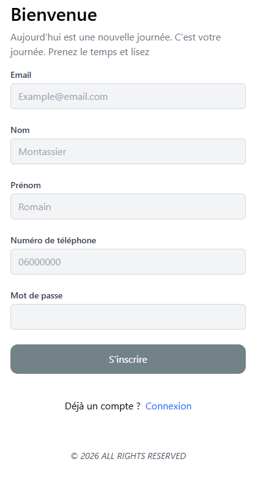
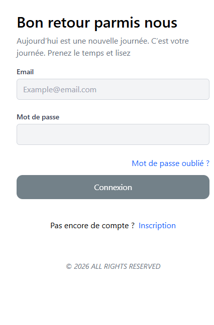
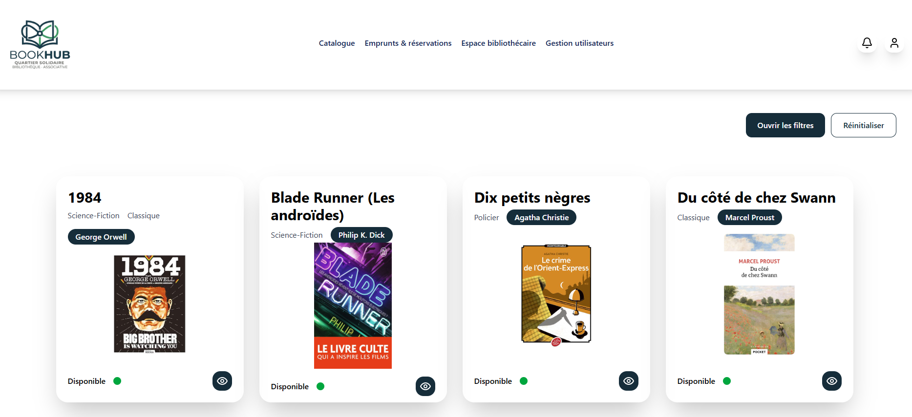
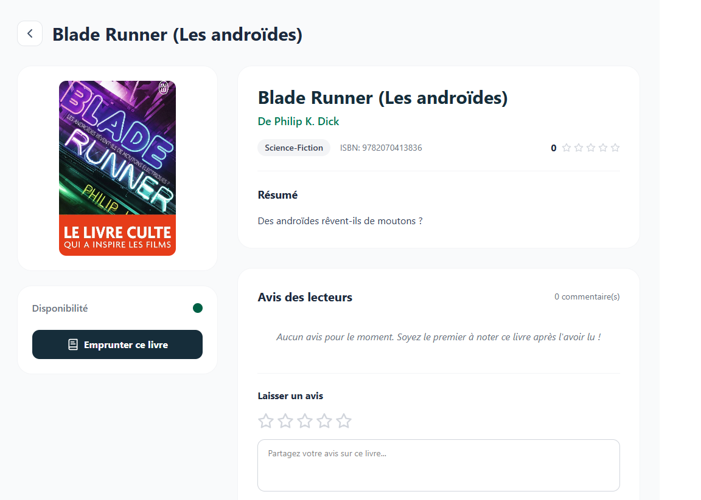
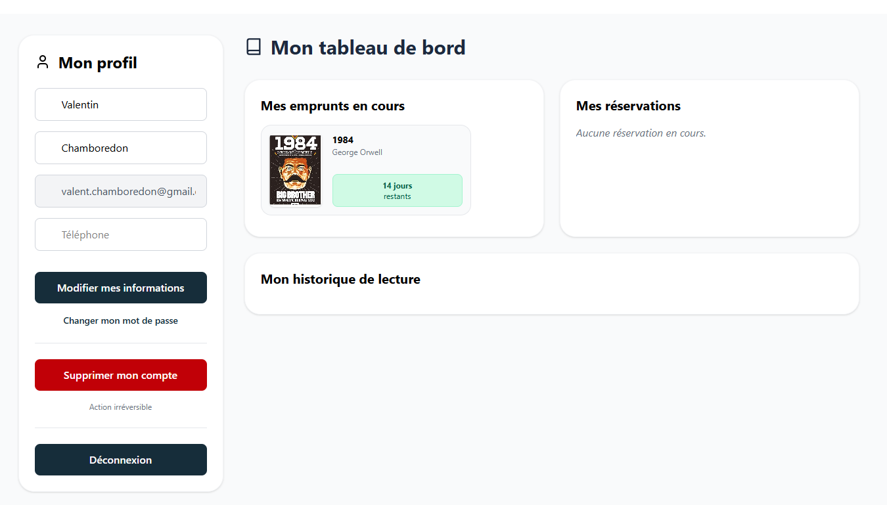
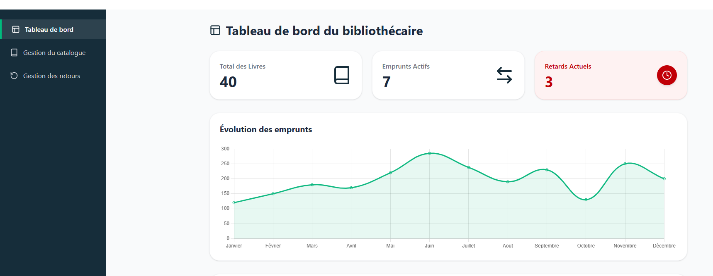
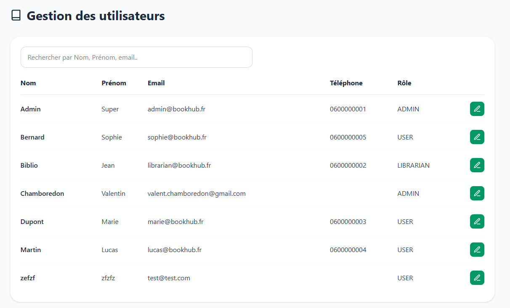

# Guide Utilisateur – BookHub

---

## Table des matières

1. [Introduction](#introduction)
2. [Connexion et inscription](#connexion-et-inscription)
3. [Guide Lecteur](#guide-lecteur)
4. [Guide Bibliothécaire](#guide-bibliothécaire)
5. [Guide Administrateur](#guide-administrateur)
6. [Notifications](#notifications)

---

## Introduction

BookHub est une plateforme web permettant aux membres d'une bibliothèque communautaire de consulter le catalogue de livres, d'emprunter et de réserver des ouvrages, et de laisser des avis.

Trois types de profils existent :

| Rôle | Description |
|---|---|
| **Lecteur (USER)** | Consulte le catalogue, emprunte, réserve, note les livres |
| **Bibliothécaire (LIBRARIAN)** | Gère le catalogue et les retours, modère les avis |
| **Administrateur (ADMIN)** | Gère les utilisateurs et leurs rôles, accès complet |

---

## Connexion et inscription

### S'inscrire

1. Accéder à la page `/register`
2. Renseigner les champs :
   - **Prénom** et **Nom** (obligatoires)
   - **Email** (obligatoire, doit être unique)
   - **Mot de passe** (obligatoire — 12 caractères minimum, 1 majuscule, 1 minuscule, 1 chiffre, 1 caractère spécial)
   - **Téléphone** (optionnel)
3. Cliquer sur **S'inscrire**

Le compte est créé avec le rôle **Lecteur** par défaut.

### Se connecter

1. Accéder à la page `/login`
2. Renseigner l'**email** et le **mot de passe**
3. Cliquer sur **Se connecter**

En cas d'identifiants incorrects, un message d'erreur s'affiche sous le formulaire.

### Se déconnecter

Cliquer sur le bouton **Déconnexion** disponible sur la page profil (en bas de page).

---

## Guide Lecteur

### Consulter le catalogue

La page d'accueil affiche la liste des livres disponibles sous forme de cartes.

**Recherche et filtres disponibles :**

| Filtre | Description |
|---|---|
| Titre | Recherche par mots-clés dans le titre |
| Auteur | Sélection parmi la liste des auteurs |
| Catégorie | Sélection parmi les catégories disponibles |
| ISBN | Recherche par numéro ISBN exact |
| Date de publication | Filtrer par année |
| Disponibilité | Afficher uniquement les livres disponibles |

Cliquer sur une carte pour accéder à la fiche détaillée du livre.

---

### Fiche détaillée d'un livre

La fiche d'un livre affiche :
- La couverture, le titre, l'auteur, la catégorie, l'ISBN
- La description (résumé)
- La disponibilité (nombre d'exemplaires disponibles / total)
- La note moyenne et les avis des lecteurs

**Bouton Emprunter** : visible si le livre est disponible. Lance une demande d'emprunt pour 14 jours.

**Bouton Réserver** : visible si le livre est indisponible. Permet de rejoindre la file d'attente.

---

### Laisser un avis

En bas de la fiche d'un livre, un formulaire permet de laisser un avis :

1. Sélectionner une note de **1 à 5 étoiles** en cliquant sur les étoiles
2. Rédiger un commentaire (optionnel)
3. Cliquer sur **Publier mon avis**

> Un seul avis par livre. Vous pouvez modifier votre avis en cliquant sur l'icône crayon à côté de votre commentaire.

---

### Mon profil

Accessible via l'icône utilisateur en haut à droite ou le lien **Emprunts & réservations**.

#### Modifier ses informations

1. Modifier le **prénom**, le **nom** ou le **téléphone** dans le formulaire
2. Cliquer sur **Enregistrer les modifications**

#### Changer de mot de passe

1. Cliquer sur **Changer mon mot de passe**
2. Saisir l'**ancien mot de passe**, le **nouveau** et la **confirmation**
3. Cliquer sur **Confirmer**

#### Supprimer son compte

1. Cliquer sur **Supprimer mon compte**
2. Confirmer la suppression dans la boîte de dialogue

> La suppression est irréversible. Elle n'est pas possible si vous avez des emprunts en cours.

---

## Guide Bibliothécaire

> Accès réservé aux comptes avec le rôle **LIBRARIAN** ou **ADMIN**.

### Tableau de bord (`/librarian`)

Le tableau de bord affiche en temps réel :
- **Nombre total de livres** dans le catalogue
- **Emprunts actifs** en cours
- **Retards** (emprunts dont la date de retour est dépassée)
- **Top 10** des livres les plus empruntés
- **Graphique** d'évolution mensuelle des emprunts

---

### Gestion du catalogue (`/catalogue-management`)

Cette page permet de gérer l'ensemble des livres de la bibliothèque.

#### Ajouter un livre

1. Cliquer sur **Ajouter un livre**
2. Renseigner dans le formulaire :
   - Titre, ISBN, description
   - Auteur(s) et catégorie(s) (sélection multiple)
   - URL de la couverture
   - Date de publication
   - Nombre d'exemplaires totaux
3. Cliquer sur **Enregistrer**

#### Modifier un livre

1. Cliquer sur l'icône **crayon** sur la carte du livre
2. Modifier les champs souhaités
3. Cliquer sur **Enregistrer**

#### Supprimer un livre

1. Cliquer sur l'icône **corbeille** sur la carte du livre
2. Confirmer la suppression

> La suppression est impossible si des exemplaires sont actuellement empruntés.

---

### Gestion des retours (`/returns-management`)

Cette page liste tous les emprunts actifs (non retournés).

#### Valider un retour

1. Retrouver l'emprunt dans la liste (filtrable par nom d'utilisateur ou titre de livre)
2. Cliquer sur **Valider le retour**
3. Le retour est enregistré, l'exemplaire est libéré

Les emprunts en retard sont mis en évidence visuellement.

---

### Modération des avis

Sur la fiche détaillée de n'importe quel livre, les bibliothécaires voient un bouton **corbeille** à côté de chaque commentaire.

1. Cliquer sur la **corbeille** à côté du commentaire à supprimer
2. Le commentaire est supprimé immédiatement

---

## Guide Administrateur

> Accès réservé aux comptes avec le rôle **ADMIN**.

L'administrateur dispose de toutes les fonctionnalités du bibliothécaire, plus la gestion des utilisateurs.

### Gestion des utilisateurs (`/admin`)

La page liste l'ensemble des comptes enregistrés.

Un champ de recherche permet de filtrer par nom, prénom ou email.

#### Modifier le rôle d'un utilisateur

1. Cliquer sur l'icône **crayon** à côté de l'utilisateur
2. Sélectionner le nouveau rôle dans la liste déroulante : `USER`, `LIBRARIAN` ou `ADMIN`
3. Cliquer sur **Enregistrer**

> Modifier le rôle d'un utilisateur prend effet immédiatement. L'utilisateur devra se reconnecter pour que les changements soient pris en compte côté client.

---

## Notifications

Une icône **cloche** est présente en haut à droite de la barre de navigation.

- Un **badge rouge** indique le nombre de notifications non lues
- Cliquer sur la cloche affiche la liste des notifications
- Les notifications sont automatiquement marquées comme lues à l'ouverture

**Exemples de notifications reçues :**
- Un livre réservé est désormais disponible
- Rappel de retour imminent
